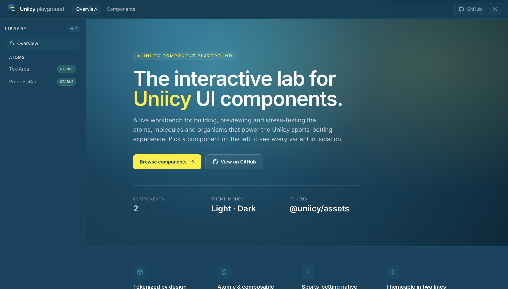

# Uniicy UI — Component Library

A **React** component library and **interactive playground** for building, previewing, and stress-testing UI used in the Uniicy sports-betting experience. The repo is a **Bun + Turborepo** monorepo: design tokens and shared utilities live in `packages/`, publishable web components live in `components/web`, and the playground in `apps/playground` is the live workbench for developers and QA.



---

## What’s in this repo

| Area               | Path                                                                         | Role                                                                                                          |
| ------------------ | ---------------------------------------------------------------------------- | ------------------------------------------------------------------------------------------------------------- |
| **Web components** | [`components/web`](./components/web)                                         | Atomic React components (`TextArea`, `Tooltip`, …), built with **tsup**, shipped as **`@dgithiomi/sbui-web`** |
| **Playground**     | [`apps/playground`](./apps/playground)                                       | Vite app to browse variants, API tables, and theme modes                                                      |
| **Design tokens**  | [`packages/assets`](./packages/assets)                                       | Color primitives, themes (light/dark), shared token source                                                    |
| **Icons**          | [`packages/icons`](./packages/icons)                                         | Shared SVG icon components (`@uniicy/icons`)                                                                  |
| **Utilities**      | [`packages/libs`](./packages/libs)                                           | Shared helpers (e.g. `cn()` via `classnames` + `tailwind-merge`)                                              |
| **Core**           | [`packages/core`](./packages/core)                                           | Shared hooks and utilities for apps in the monorepo                                                           |
| **Consumer docs**  | [`docs/consumer-integration-guide.md`](./docs/consumer-integration-guide.md) | Full guide for teams integrating the library in React or Next.js                                              |

---

## Features

- **Atomic design** — Components organized as atoms (molecules/organisms planned as the library grows).
- **Token-driven theming** — Colors from `@uniicy/assets` become CSS variables and Tailwind utilities (`text-fg`, `bg-surface`, `border-outline`, …).
- **Light & dark** — Theme variables follow `prefers-color-scheme` and a `.dark` class for manual toggling.
- **Shipped stylesheet** — One import (`@dgithiomi/sbui-web/styles.css`) gives consumers tokens, Tailwind utilities, and component CSS (e.g. tooltip animations).
- **TypeScript-first** — Props documented in `.types.ts` files; declarations published in `dist/`.
- **Interactive playground** — Sidebar navigation, variant sections, props tables, and status badges for each component.

---

## Repository structure

```
sb-component-library/
├── apps/
│   └── playground/          # Vite + React docs / demo app
├── components/
│   └── web/                 # @dgithiomi/sbui-web — publishable component library
│       ├── src/atoms/       # TextArea, Tooltip, …
│       ├── scripts/         # build-styles.ts (Tailwind → dist/styles.css)
│       └── dist/            # Built JS + styles.css (after build)
├── packages/
│   ├── assets/              # Design tokens (colors, themes)
│   ├── icons/               # @uniicy/icons
│   ├── libs/                # @uniicy/libs (cn, etc.)
│   └── core/                # Shared hooks
├── docs/
│   ├── consumer-integration-guide.md
│   └── images/              # README & doc assets
├── turbo.json
└── package.json
```

---

## Components (web)

| Component    | Status | Description                                                                                   |
| ------------ | ------ | --------------------------------------------------------------------------------------------- |
| **TextArea** | Stable | Controlled multi-line input with status, character count, clear, addons, and optional tooltip |
| **Tooltip**  | Stable | Accessible overlay with placement, triggers, variants, and animations                         |

More atoms will appear in the playground sidebar as they are added.

---

## Prerequisites

- **[Bun](https://bun.sh)** `1.3+` (package manager for this monorepo — use `bun install`, not `npm install`, because of `workspace:*` dependencies)
- **Node.js** 20+ (for tooling compatibility)

---

## Getting started (contributors & testers)

### 1. Clone and install

```bash
git clone https://github.com/githiomi/sb-ui.git
cd sb-component-library   # or your local folder name
bun install
```

### 2. Run the playground and library in dev mode

From the **repository root**:

```bash
bun run dev
```

This uses **Turborepo** to:

1. Build workspace dependencies (`@dgithiomi/sbui-web`, icons, etc.)
2. Start **`@dgithiomi/sbui-web`** in watch mode (`tsup --watch`)
3. Start the **playground** Vite dev server

Open the URL Vite prints (typically `http://localhost:5173`). Use the sidebar to open **TextArea** (and other components as they are added), try variants, and read the API reference at the bottom of each page.

### 3. Build everything

```bash
bun run build
```

### 4. Build only the component library

```bash
cd components/web
bun run build          # JS + types (styles rebuilt via tsup onSuccess)
bun run build:styles   # stylesheet only, when needed
```

---

## How the web library is built

Understanding this helps when debugging styling or publishing.

1. **JavaScript** — [`components/web/tsup.config.ts`](./components/web/tsup.config.ts) bundles `index.ts` to `dist/index.mjs` / `.cjs` and generates `dist/index.d.ts`.
2. **Styles** — [`components/web/scripts/build-styles.ts`](./components/web/scripts/build-styles.ts):
    - Prepends auto-generated **CSS variables** (light/dark) from tokens
    - Processes [`src/styles.css`](./components/web/src/styles.css) with PostCSS (`postcss-import`, Tailwind, Autoprefixer)
    - Inlines per-component CSS (e.g. [`Tooltip.css`](./components/web/src/atoms/Tooltip/Tooltip.css))
    - Writes **`dist/styles.css`**
3. **Watch** — `tsup --watch` runs `build-styles` on success so `dist/styles.css` is not left missing after a clean rebuild.

**Adding component CSS:** create `src/atoms/<Component>/<Component>.css` and add `@import "./atoms/<Component>/<Component>.css";` in `src/styles.css`.

---

## Using the library in your app (consumers)

The published npm package name is **`@dgithiomi/sbui-web`** (configurable before publish). Consumers need:

1. **Install** the package and React peers
2. **Import the stylesheet once** at the app root
3. **Import components** from `"@dgithiomi/sbui-web"`
4. **(Optional)** Add `@dgithiomi/sbui-web/tailwind-preset` if their app uses the same Tailwind tokens

### Quick start

```bash
bun add @dgithiomi/sbui-web react react-dom
# or: npm install @dgithiomi/sbui-web react react-dom
```

```tsx
// main.tsx or app/layout.tsx — import once
import "@dgithiomi/sbui-web/styles.css";

// Your component file
import { TextArea } from "@dgithiomi/sbui-web";
import { useState } from "react";

export function Notes() {
    const [value, setValue] = useState("");
    return (
        <TextArea
            id="notes"
            value={value}
            onChange={setValue}
            placeholder="Add a note…"
        />
    );
}
```

**Next.js (App Router):** put interactive usage in a `"use client"` file and import `@dgithiomi/sbui-web/styles.css` in `app/layout.tsx`.

For **React + Vite**, **Next.js Pages/App Router**, Tailwind preset setup, dark mode, troubleshooting, and a pre-publish checklist, see:

**[docs/consumer-integration-guide.md](./docs/consumer-integration-guide.md)**

---

## Global provider usage (recommended)

`SbuiProvider` is the single top-level wrapper for library features that require React context (Toast now, more features later).

### Why `enableToastProvider` exists

- `enableToastProvider` is an **optional boolean prop** on `SbuiProvider`.
- Default is `true`, so Toast context is mounted automatically.
- You only set `enableToastProvider={false}` for advanced cases (for example:
  tests, custom host-level toast system, or temporarily disabling Toast behavior).
- In normal consumer apps, you should **not** set it; keep default behavior.

### One-wrapper setup

```tsx
// main.tsx / app root
import { SbuiProvider } from "@dgithiomi/sbui-web";
import "@dgithiomi/sbui-web/styles.css";

export function Root() {
    return (
        <SbuiProvider>
            <App />
        </SbuiProvider>
    );
}
```

### Triggering Toast from components

```tsx
import { useToast } from "@dgithiomi/sbui-web";

export function SaveButton() {
    const { showToast } = useToast();

    return (
        <button
            onClick={() =>
                showToast({
                    variant: "success",
                    title: "Saved",
                    message: "Your changes were saved.",
                    duration: "short",
                })
            }
        >
            Save
        </button>
    );
}
```

If `enableToastProvider={false}`, `useToast()` will throw unless you provide `ToastProvider` yourself.

---

## Package exports (`@dgithiomi/sbui-web`)

| Import                                | Description                         |
| ------------------------------------- | ----------------------------------- |
| `@dgithiomi/sbui-web`                 | React components + TypeScript types |
| `@dgithiomi/sbui-web/styles.css`      | Global stylesheet (required)        |
| `@dgithiomi/sbui-web/tailwind-preset` | Tailwind v3 preset for host apps    |

**Peer dependencies:** `react`, `react-dom` (^19). `tailwindcss` (^3.4) is optional if the host app uses the preset.

---

## Playground

The playground ([`apps/playground`](./apps/playground)) is **not** published to npm. It exists to:

- Preview every variant of each component in isolation
- Document props via shared tables ([`PropsTable`](./apps/playground/src/layouts/shared/PropsTable.tsx))
- Validate light/dark theming and design tokens end-to-end
- Give QA a stable URL to regression-test UI before release

To run only the playground (after a root install and build):

```bash
cd apps/playground
bun run dev
```

---

## Theming & tokens

- **Source of truth:** [`packages/assets/colors.ts`](./packages/assets/colors.ts)
- **Tailwind mapping:** [`components/web/tailwind-theme.ts`](./components/web/tailwind-theme.ts)
- **Semantic utilities:** `text-fg`, `text-link`, `bg-surface`, `bg-canvas`, `border-outline`, etc.
- **Primitives:** `primary`, `accent`, `success`, `error`, `warning`, `neutral` (with shades)

Prefer semantic classes in components so light/dark switches without changing JSX.

---

## Scripts (root)

| Command         | Description                                    |
| --------------- | ---------------------------------------------- |
| `bun run dev`   | Start library watch + playground (Turbo)       |
| `bun run build` | Build all packages and apps                    |
| `bun run test`  | Placeholder — add tests as the library matures |

---

## Publishing (maintainers)

Before publishing `@dgithiomi/sbui-web` to npm:

1. Run `bun run build` in `components/web` and verify `dist/` includes JS, types, and `styles.css`.
2. Confirm the package tarball has no `workspace:*` dependencies with `npm pack --dry-run`.
3. Publish from `components/web` using `npm publish --access public`.
4. Install `@dgithiomi/sbui-web` in a separate React/Next.js app and import `@dgithiomi/sbui-web/styles.css` once.

See the **Before publishing** section in [docs/consumer-integration-guide.md](./docs/consumer-integration-guide.md).

---

## Roadmap

- Additional atoms, molecules, and organisms
- Native component package (`components/native`)
- Storybook or visual regression tests
- Automated npm publish workflow

---

## License

**ISC** — see [package.json](./package.json) for author and repository links.

---

## Links

- **Repository:** [github.com/githiomi/sb-ui](https://github.com/githiomi/sb-ui)
- **Issues:** [github.com/githiomi/sb-ui/issues](https://github.com/githiomi/sb-ui/issues)
- **Integration guide:** [docs/consumer-integration-guide.md](./docs/consumer-integration-guide.md)
